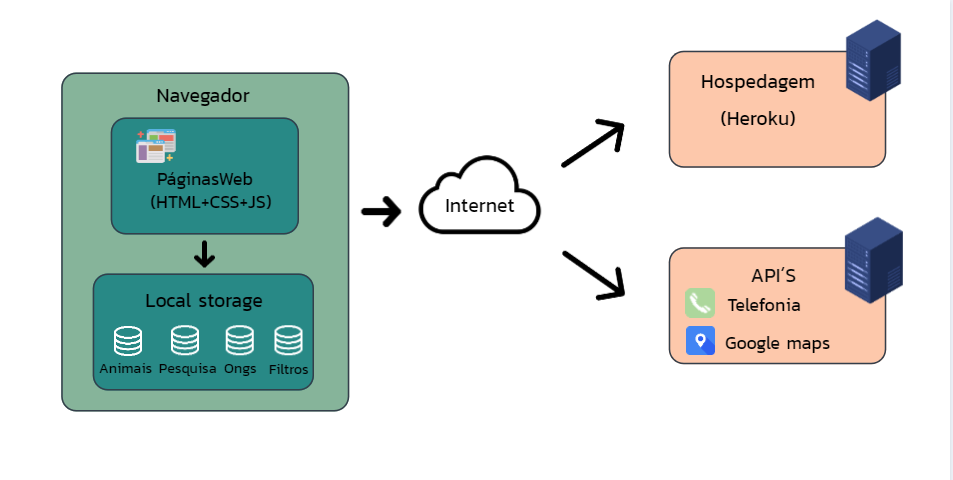

# Arquitetura da Solução

Os detalhes técnicos utilizados para a solução do projeto serão explicados abaixo 
no qual iremos abordar as linguagens utilizadas, API's, o Local Store e a hospedagem do Site.

## Diagrama de componentes

Abaixo iremos demonstrar através de uma figura os componentes que fazem parte da solução.

Figura 1 - Componentes

 
 

Os tópicos abaixo descrevem os seguintes módulos que iremos utilizar para a implantação da solução:
- **Navegador** - A interface do sistema será básica. 
  - **Páginas Web** - O desenvolvimento de interfaces WEB irá utilizar as linguagens de um conjunto de arquivos como HTML, CSS, JavaScript e também iremos utilizar imagens que implementam as funcionalidades do sistema.
   - **Local Storage** - O armazenamento será mantido no Navegador, onde serão implementados bancos de dados baseados em JSON. São eles: 
     - **Pesquisa** - As três últimas pesquisas.
     - **ONGs** - A lista de ongs.
     - **Animais** - Lista de animais para doação.
     - **Filtro** - Lista de opções de filtros.
 - **API's** - Retornará resultados de pesquisa JSON para artigos de notícias exibidas no site.
     - **Telefonia** - Permitem disparar ligações telefônicas e SMS diretamente do seu sistema ou aplicativo de forma simples, sem necessidade de centrais telefônicas, de linhas telefônicas ou de equipamento.
     - **Google Maps** - Sendo uma ferramenta de GPS por meio de mapas do google o usuário pode conferir e encontrar locais.

 - **Hospedagem** - Será através do Heroku responsável por manter o site funcionando na internet onde as páginas são mantidas e acessadas pelo navegador.

## Hospedagem

Para hospedagem do site do projeto iremos utilizar o Heroku uma plataforma nuvem que faz deploy de várias aplicações back-end seja para hospedagem, teste em produção ou escalar as aplicações. O site será mantido no ambiente URL:

O site utiliza a plataforma do Heroku como ambiente de hospedagem do site do projeto. O site é mantido no ambiente da URL: 

> - [Heroku](https://dashboard.heroku.com/apps)
